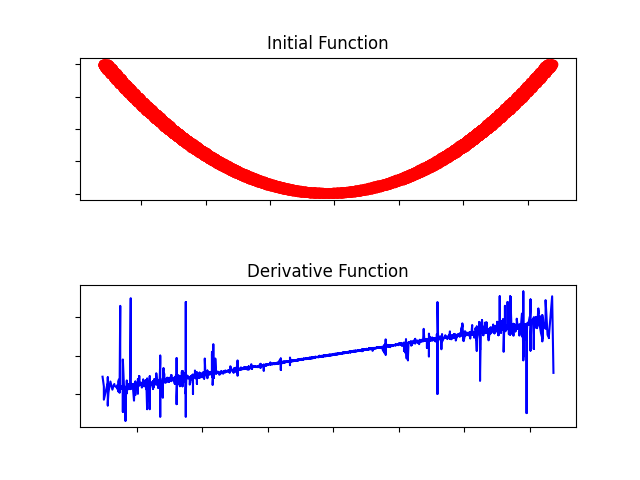

# DerivGrapher

DerivGrapher takes an image with an arbitrary graph as an input
and returns derivative of the graph.

It utilizes pixels of the image and *np.diff* to get a reasonable
gauge of the function's derivative. There is a presence of a slight noise
within the image due to lack of precision with pixel computations.

## Basic Usage
```python
from graphDerivative import GDerivative

# Create a derivative of the graph
graphed = GDerivative('images/graph.png')

# Show the graph with matplotlib
graphed.showGraph()

# Save the graph
graphed.saveGraph('images/graph.png')
```

### Example output given [x^2 graph](images/graph.png) as input
**(Derivative should be approx similar to graph of 2x)**


